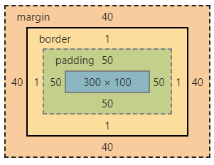
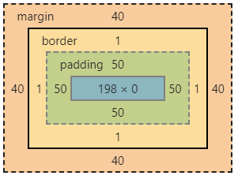

# flexbox-vs-grid
__Flexbox__ is essentially for laying out items in a __single dimension__– in a row OR a column. 
__Grid__ is for layout of items in __two dimensions__– rows and columns.   
https://tutorialzine.com/2017/03/css-grid-vs-flexbox   
https://css-tricks.com/css-grid-replace-flexbox   

NOTE: it is also possible to achieve two dimensions using flexbox, it is presented in examples flexbox-layout-possibility{n}.

## flexbox
Examples flexbox-layout-possibility{n} show how to build the same layout using different methods:

possibility1: use one flex container      
possibility2: use two flex containers

http://the-echoplex.net/flexyboxes/
* __flex-flow__:   flex-direction (default is row) flex-wrap (default is wrap). Should be used __on container.__
  * flex-direction:  When direction is row it means that elements are arranged from left to right. When direction is column the elements are arranged from top to down.
  * flex-wrap
* __flex__: flex-grow (default is 0) flex-shrink (default is 1) flex-basis (default is auto). Should be used __on items.__    
  * __flex-grow__ property specifies how much the item will grow relative to the rest of the flexible items inside the same container.
  __0 = don't grow__   
  * __flex-shrink__ property specifies how the item will shrink relative to the rest of the flexible items inside the same container.
  __0 = don't shrink__
  * __flex-basis__ property specifies the initial length of a flexible item.   __auto__ means that the length is equal to the length of the flexible item.
  If the item has no length specified, the length will be according to its content. __This property can be used to go to the new row(column).__


## grid

# data table width
https://stackoverflow.com/questions/21651767/html-table-both-fixed-and-multiple-variable-column-widths
https://stackoverflow.com/questions/46885284/angular-4-material-table-resizable-columns
https://stackoverflow.com/questions/3941231/html-table-fixed-width-columns-and-horizontal-scroll
https://codepen.io/paulobrien/pen/gWoVzN

# shadow DOM / custom elements (web components)
https://developer.mozilla.org/en-US/docs/Web/Web_Components   
https://developer.mozilla.org/en-US/docs/Web/Web_Components/Using_shadow_DOM   
https://github.com/mdn/web-components-examples/tree/master/popup-info-box-external-stylesheet   

[customElements.define vs document.registerElement](https://stackoverflow.com/questions/46476905/what-is-the-difference-between-window-customelements-define-and-document-regis)

# layouts

## layout_by_flexbox.html

[layout_by_flexbox.html](./layouts/layout_by_flexbox.html)
* to have 100% height of the main container set ```height: 100%``` for tags html, body and also set ``` min-height: 100%``` for the main container.
* to have fixed height header and footer just set ```flex-basis``` to neccessary height, for example ```flex: 0 0 40px```.
* to fill in remaing area by the main content set ```flex: 1```.

Another simple example:
```html
<body>
    <div class="container">
        <div class="box box-1">box 1</div>
        <div class="box box-2">box 2</div>
        <div class="box box-3">box 3</div>
    </div>
</body>
```

```css
html,
body {
	height: 100%;
	margin: 0;
}

.container {
	height: 100%;
	min-height: 100%;
	display: flex;
	flex-direction: column;
}

.box {
		text-align: center;
		color: white;
		font-family: sans-serif;
		font-size: 36px;
		padding: 20px;
		
		display: flex;
		flex-direction: column;
		justify-content: center;
	}
	
.box-1 {
	background-color: green;
	height: 60px;
}

.box-2 {
	background-color: blue;
	flex: 1;
}

.box-3 {
	background-color: red;
	height: 60px;
}
```

# box sizing

Default (width and height counted for the content only).   
width + padding + border = actual width of an element   
height + padding + border = actual height of an element   
   
Border-box (width and height counted for the whole element):   
