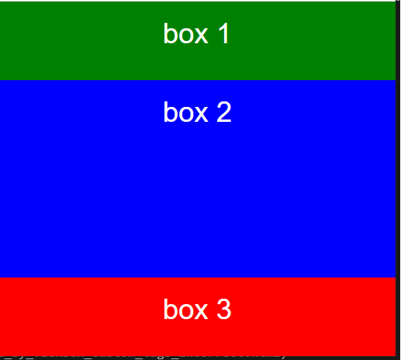
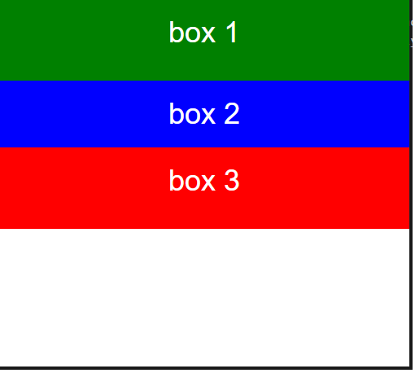

- [flexbox-vs-grid](#flexbox-vs-grid)
	- [flexbox](#flexbox)
	- [grid](#grid)
- [data table width](#data-table-width)
- [shadow DOM / custom elements (web components)](#shadow-dom--custom-elements-web-components)
- [layouts](#layouts)
	- [layout_by_flexbox.html](#layout_by_flexboxhtml)
	- [layout_by_nested_flexbox_scrollbars.html](#layout_by_nested_flexbox_scrollbarshtml)
	- [layout by flexbox with custom tags](#layout-by-flexbox-with-custom-tags)
- [box sizing](#box-sizing)
- [rem vs em](#rem-vs-em)
- [scss partials](#scss-partials)
# flexbox-vs-grid
__Flexbox__ is essentially for laying out items in a __single dimension__– in a row OR a column. 
__Grid__ is for layout of items in __two dimensions__– rows and columns.   
https://tutorialzine.com/2017/03/css-grid-vs-flexbox   
https://css-tricks.com/css-grid-replace-flexbox   

NOTE: it is also possible to achieve two dimensions using flexbox, it is presented in examples flexbox-layout-possibility{n}.

## flexbox
Examples flexbox-layout-possibility{n} show how to build the same layout using different methods:

possibility1: use one flex container      
possibility2: use two flex containers

http://the-echoplex.net/flexyboxes/
* __flex-flow__:   flex-direction (default is row) flex-wrap (default is wrap). Should be used __on container.__
  * flex-direction:  When direction is row it means that elements are arranged from left to right. When direction is column the elements are arranged from top to down.
  * flex-wrap
* __flex__: flex-grow (default is 0) flex-shrink (default is 1) flex-basis (default is auto). Should be used __on items.__    
  * __flex-grow__ property specifies how much the item will grow relative to the rest of the flexible items inside the same container.
  __0 = don't grow__   
  * __flex-shrink__ property specifies how the item will shrink relative to the rest of the flexible items inside the same container.
  __0 = don't shrink__
  * __flex-basis__ property specifies the initial length of a flexible item.   __auto__ means that the length is equal to the length of the flexible item.
  If the item has no length specified, the length will be according to its content. __This property can be used to go to the new row(column).__


## grid

# data table width
https://stackoverflow.com/questions/21651767/html-table-both-fixed-and-multiple-variable-column-widths
https://stackoverflow.com/questions/46885284/angular-4-material-table-resizable-columns
https://stackoverflow.com/questions/3941231/html-table-fixed-width-columns-and-horizontal-scroll
https://codepen.io/paulobrien/pen/gWoVzN

# shadow DOM / custom elements (web components)
https://developer.mozilla.org/en-US/docs/Web/Web_Components   
https://developer.mozilla.org/en-US/docs/Web/Web_Components/Using_shadow_DOM   
https://github.com/mdn/web-components-examples/tree/master/popup-info-box-external-stylesheet   

[customElements.define vs document.registerElement](https://stackoverflow.com/questions/46476905/what-is-the-difference-between-window-customelements-define-and-document-regis)

# layouts

## layout_by_flexbox.html

[layout_by_flexbox.html](./layouts/layout_by_flexbox.html)
* to have 100% height of the main container set ```height: 100%``` for tags html, body and also set ``` min-height: 100%``` for the main container.
* to have fixed height header and footer just set ```flex-basis``` to neccessary height, for example ```flex: 0 0 40px```.
* to fill in remaing area by the main content set ```flex: 1```.

Another simple example:
```html
<body>
    <div class="container">
        <div class="box box-1">box 1</div>
        <div class="box box-2">box 2</div>
        <div class="box box-3">box 3</div>
    </div>
</body>
```

```css
html,
body {
	height: 100%;
	margin: 0;
}

.container {
	height: 100%;
	min-height: 100%;
	display: flex;
	flex-direction: column;
}

.box {
		text-align: center;
		color: white;
		font-family: sans-serif;
		font-size: 36px;
		padding: 20px;
		
		display: flex;
		flex-direction: column;
		justify-content: center;
	}
	
.box-1 {
	background-color: green;
	height: 60px;
}

.box-2 {
	background-color: blue;
	flex: 1;
}

.box-3 {
	background-color: red;
	height: 60px;
}
```

## layout_by_nested_flexbox_scrollbars.html

[layout_by_nested_flexbox_scrollbars.html](./layouts/layout_by_nested_flexbox_scrollbars.html)   
This example shows how to created layout using nested flexbox with additional vertical scroll bars in selected sections.
>NOTE: it is important to place nested flexbox on the same level as flex-item from the parent flexbox. Only then scroll bars work correctly. There is another example [layout_by_nested_flexbox_scrollbars_not_working.html](./layouts/layout_by_nested_flexbox_scrollbars_not_working.html) with ```div``` between flexboxes where scroll bars do not work correctly.   
Correct:
```css
.document__container__main {
	flex: 0 1 calc(100% - 60px);
	border: 1px solid red;
	max-height: calc(100% - 60px);
	/*it is also next flex 'container'*/
	display: flex;
	flex-direction: row;
}
```
Incorrect:
```css
.document__container__main {
	flex: 0 1 calc(100% - 60px);
	border: 1px solid red;
	max-height: calc(100% - 60px);
}
.document__container__main__container {
	display: flex;
	flex-direction: row;
}
```
## layout by flexbox with custom tags

If we use custom tags then we have to apply proper css styles directly on these custom tags and not on the 'root' tag in the custom tag. There is no error in web browser and layout is not rendered properly!

[correct-implementation](./layouts/layout_by_flexbox_custom_tags_correct.html)

```html
<body>
    <div class="container">
		<my-custom-header class="box box-1">
			<div>box 1</div>
		</my-custom-header>
		<my-custom-main class="box box-2">
			<div>box 2</div>
		</my-custom-main>
		<my-custom-footer class="box box-3">
			<div>box 3</div>
		</my-custom-footer>
    </div>
</body>
```



[incorrect-implementation](./layouts/layout_by_flexbox_custom_tags_incorrect.html)

```html
<body>
    <div class="container">
		<my-custom-header>
			<div class="box box-1">box 1</div>
		</my-custom-header>
		<my-custom-main>
			<div class="box box-2">box 2</div>
		</my-custom-main>
		<my-custom-footer>
			<div class="box box-3">box 3</div>
		</my-custom-footer>
    </div>
</body>
```



# box sizing

[box-sizing](./box-sizing)

Default (width and height counted for the content only).   
width + padding + border = actual width of an element   
height + padding + border = actual height of an element   
   
Border-box (width and height counted for the whole element):   


# rem vs em

[rem-vs-em](https://medium.com/@hossam.hilal0/rem-vs-em-units-in-css-96d5ac15878e)   

[example em](./pem-vs-em/index-em.html)   
[example rem](./pem-vs-em/index-rem.html)   

- em units for the font-size property will be relative to the font-size of the parent element.
- em units on other properties than font-size will be relative to the font-size of the current element.
- rem units sizes will always be relative to the font-size of the root html element. suited for your use cases. Let’s break it down as briefly as possible.


In most browsers, a user can set their default browser font-size to be a different size to the default (typically 16px). If the user sets their default to 20px, all font-sizes should scale accordingly.
However, if the website explicitly sets font-sizes in pixels, a heading set at 30px will always be 30px. That might sound great from a designer/developer point of view — but you’re not the user, stop making websites for yourself.


em unit is problematic when we want use multiple times 'child' class. To avoid this problem **rem** unit was created.

```css
.parent {   
   font-size: 15px; 
}
.child {   
   font-size: 2em; 
}
```

```html
<div class="parent">   
    I'm 15px   
    <div class="child">   
         I'm 30px, as expected     
         <div class="child">     
              I'm 60px, trouble starts!       
              <div class="child">       
                   I'm 120px, now we're really in trouble!
              </div>     
         </div>   
    </div> 
</div>
```

# scss partials

[partials](https://sass-lang.com/guide)

>"You can create partial Sass files that contain little snippets of CSS that you can include in other Sass files. This is a great way to modularize your CSS and help keep things easier to maintain. A partial is a Sass file named with a leading underscore. You might name it something like _partial.scss. The underscore lets Sass know that the file is only a partial file and that it should not be generated into a CSS file. Sass partials are used with the @use rule."
